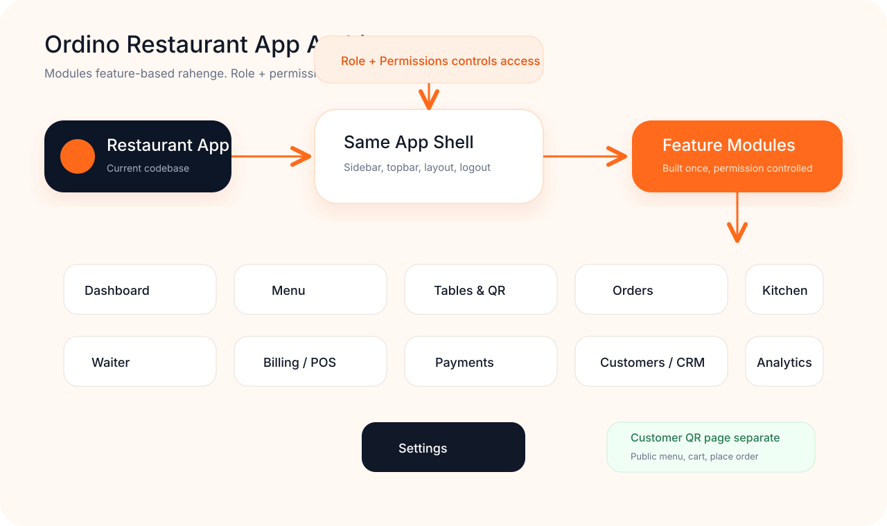
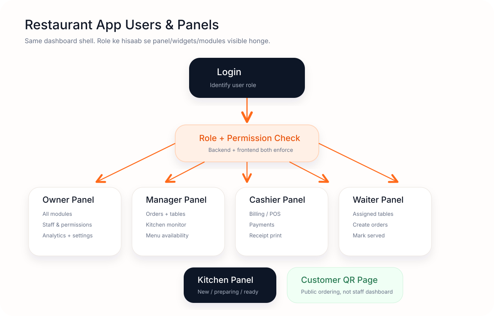

# Restaurant App Modules & Permissions

## Owner permissions

Yes, restaurant owner can update roles and permissions inside their own restaurant workspace.

Recommended MVP permissions for Owner:

- add/edit/deactivate staff users
- assign predefined roles: Manager, Cashier, Waiter, Kitchen
- update module access for staff
- manage restaurant settings, menu, tables, billing, analytics, CRM

Owner should not be allowed to:

- change platform/admin permissions
- change subscription/payment records manually
- remove the last active owner
- access another restaurant's data

For MVP, keep roles predefined. Custom role builder can come later.
