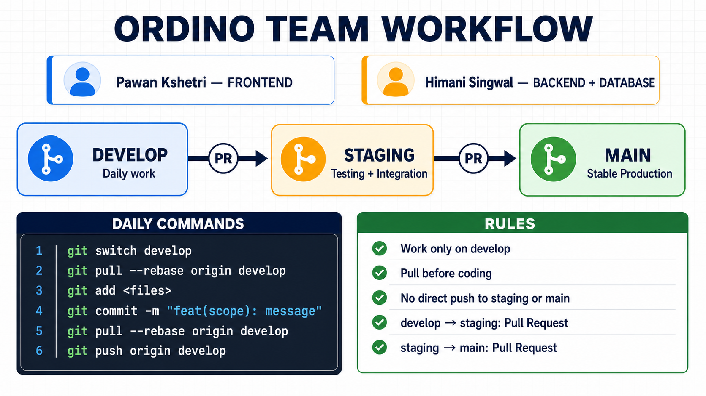
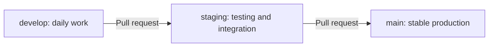
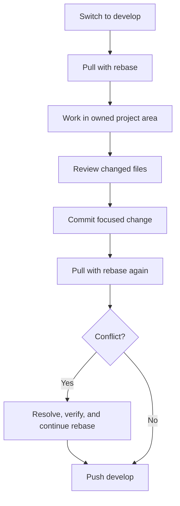
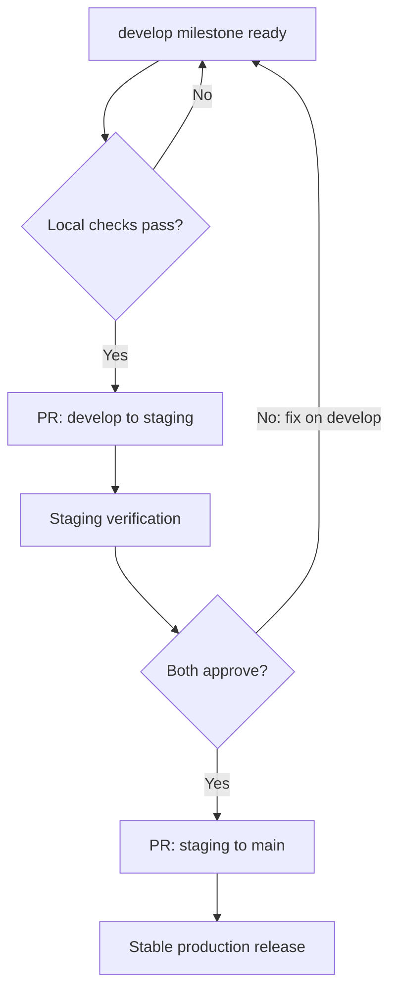
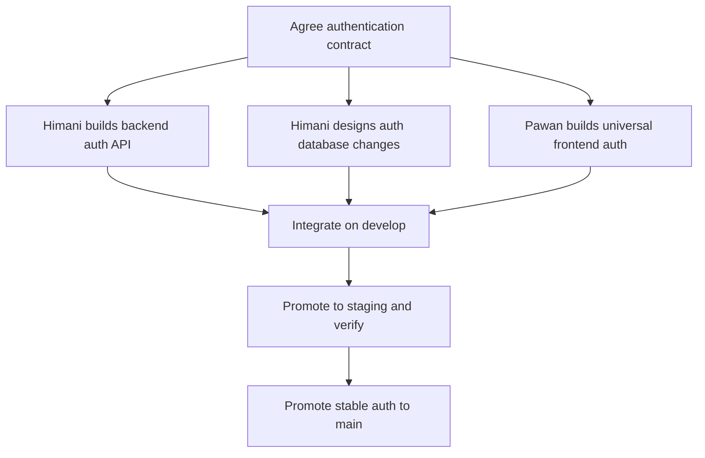
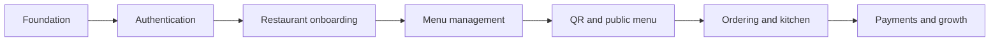

# Ordino — Team Development Guide

This is the shared working agreement for the Ordino Restaurant QR SaaS project. Pawan Kshetri and Himani Singwal should update this document whenever workflow, ownership, decisions, or milestone status changes.

> Current milestone: **Phase 1 — Authentication foundation**
>
> Permanent branch flow: **`develop` → `staging` → `main`**
>
> Branch limit: **Exactly three permanent branches; no feature branches**

## Visual workflow



## 1. Team ownership

| Area | Primary owner | Reviewer / collaborator |
| --- | --- | --- |
| Universal frontend for web, Android, and iOS | Pawan Kshetri | Himani Singwal |
| Backend APIs and server | Himani Singwal | Pawan Kshetri |
| Database design, migrations, and data integrity | Himani Singwal | Pawan Kshetri |
| API contracts and integration decisions | Both developers | Both developers |
| Staging verification and production release | Both developers | Both developers |
| Documentation and shared project configuration | Both developers | Both developers |

### Primary code paths

| Path | Primary owner |
| --- | --- |
| `frontend/**` | Pawan Kshetri |
| `backend/**` | Himani Singwal |
| Future database and migration files | Himani Singwal |
| `docs/**` and root configuration | Both developers |

Ownership identifies the lead developer. Shared decisions still require discussion and review from both developers.

## 2. Exactly three branches

| Branch | Purpose | Who works directly on it? |
| --- | --- | --- |
| `develop` | Daily frontend, backend, database, and documentation work | Pawan and Himani |
| `staging` | Integrated milestone testing | No direct work; receives PRs from `develop` |
| `main` | Stable production-ready releases | No direct work; receives PRs from `staging` |

### Non-negotiable rules

- Do not create feature, personal, frontend, backend, or hotfix branches.
- Both developers commit directly to `develop` after pulling the latest changes.
- Never push code directly to `staging` or `main`.
- Move code from `develop` to `staging` only through a pull request.
- Move code from `staging` to `main` only through a pull request.
- Fix staging or production problems on `develop`, then promote the fix through the same flow.
- Never force-push any of the three branches.
- Never delete `develop`, `staging`, or `main`.



## 3. One-time repository setup

The repository owner creates `staging` once from the latest `develop`:

```bash
git switch develop
git pull --ff-only origin develop
git switch -c staging
git push -u origin staging
git switch develop
```

Then configure GitHub:

1. Keep `main` as the default branch.
2. Add both developers as collaborators.
3. Protect `staging` and `main`.
4. Require pull requests and at least one approval for `staging` and `main`.
5. Disable force pushes and branch deletion for all three branches.
6. Allow both collaborators to push normal commits to `develop`.
7. Enable required automated checks when CI is introduced.
8. Allow **Create a merge commit** for promotion pull requests.

The second developer clones the repository and prepares all three local branches:

```bash
git clone https://github.com/Pawankshetri11/Ordino.git
cd Ordino
git switch develop
git pull --ff-only origin develop
git switch --track origin/staging
git switch develop
```

## 4. Daily workflow on `develop`

Both developers follow the same sequence. Pawan normally changes `frontend/**`; Himani normally changes `backend/**` and database files.

### Step 1 — Update before coding

```bash
git switch develop
git pull --rebase origin develop
git status
```

Do not begin coding until the pull succeeds and the working tree state is understood.

### Step 2 — Work only in your owned area

- Pawan communicates before changing backend or database code.
- Himani communicates before changing frontend code.
- Both communicate before editing the same documentation or root configuration file.
- Keep one main task in progress per developer.

### Step 3 — Inspect and commit focused changes

```bash
git status
git diff
git add <specific-files>
git diff --staged
git commit -m "feat(frontend): add login screen"
```

Recommended commit messages:

```text
feat(frontend): add login screen
feat(backend): add authentication endpoint
feat(database): add authentication schema
fix(frontend): handle invalid login response
fix(backend): reject invalid credentials
docs: update authentication contract
chore: update development dependency
```

### Step 4 — Update again before pushing

Another developer may have pushed while you were coding:

```bash
git pull --rebase origin develop
```

If the rebase succeeds, run the relevant local verification and push:

```bash
git push origin develop
```

If Git rejects the push because `develop` changed, repeat:

```bash
git pull --rebase origin develop
git push origin develop
```



## 5. Resolving a `develop` conflict

When `git pull --rebase origin develop` reports a conflict:

1. Run `git status` and identify each conflicted file.
2. Discuss shared API or configuration conflicts together.
3. Edit the file and remove all conflict markers.
4. Stage the resolved file and continue the rebase.

```bash
git status
git add <resolved-files>
git rebase --continue
```

After the rebase completes:

```bash
git status
git push origin develop
```

If the resolution is incorrect or unclear, safely stop the rebase and discuss it:

```bash
git rebase --abort
```

Never use force push to solve a shared-branch conflict.

## 6. Promotion from `develop` to `staging`

Promote only a complete, agreed milestone or testable milestone slice.

1. Both developers finish and push their milestone work to `develop`.
2. Confirm `develop` builds and the agreed checks pass.
3. Open a pull request with base `staging` and compare `develop`.
4. The other developer reviews the combined frontend/backend impact.
5. Merge using **Create a merge commit**.
6. Test only the promoted snapshot on `staging`.

GitHub CLI command:

```bash
gh pr create --base staging --head develop --title "release: promote develop to staging"
```

If staging testing finds a bug, do not edit `staging`. Fix it on `develop`, push it, and promote `develop` to `staging` again.

## 7. Promotion from `staging` to `main`

Promote only after both developers accept staging verification.

1. Confirm the staging checklist is complete.
2. Open a pull request with base `main` and compare `staging`.
3. Both developers review the release summary.
4. Merge using **Create a merge commit**.
5. Confirm `main` contains only stable, production-ready work.

GitHub CLI command:

```bash
gh pr create --base main --head staging --title "release: promote staging to main"
```



## 8. Authentication-first development plan

Frontend and backend authentication work happens in parallel on the shared `develop` branch only after both developers agree on the contract.

### Shared contract decisions

- [ ] Define authentication scope for the first version.
- [ ] Define required user fields and validation rules.
- [ ] Agree on endpoint paths and HTTP methods.
- [ ] Agree on request, success response, and error response shapes.
- [ ] Decide user roles required in the first milestone.
- [ ] Decide the database and migration approach.
- [ ] Decide how sessions are created, stored, refreshed, expired, and revoked.
- [ ] Decide logout and expired-session behavior for web, Android, and iOS.
- [ ] Record decisions in the decision log below.

### Pawan Kshetri — frontend

- [ ] Build shared authentication UI for web, Android, and iOS.
- [ ] Add validation based only on the agreed API contract.
- [ ] Add loading, success, error, logout, and expired-session states.
- [ ] Integrate with the real backend after the contract is available.
- [ ] Verify the supported frontend targets.
- [ ] Commit only frontend-focused changes to `develop`.

### Himani Singwal — backend and database

- [ ] Design the minimum authentication data model.
- [ ] Introduce database configuration and migrations only after the stack decision is recorded.
- [ ] Implement backend validation and authentication endpoints.
- [ ] Keep secrets and credential handling entirely server-side.
- [ ] Add backend tests when the test setup is introduced.
- [ ] Commit focused backend/database changes to `develop`.

### Joint integration

- [ ] Pull the latest combined `develop`.
- [ ] Verify frontend-to-backend authentication behavior.
- [ ] Verify invalid, unauthorized, expired, and logout flows.
- [ ] Update this guide and the API contract.
- [ ] Promote the completed auth milestone to `staging`.



## 9. Incremental product roadmap

Finish and stabilize one phase before starting the next major phase.

| Phase | Goal | Frontend lead | Backend/database lead | Exit condition |
| --- | --- | --- | --- | --- |
| 0 | Universal frontend, Express backend, and team workflow | Pawan | Himani | Three branches and collaboration workflow are ready |
| 1 | Authentication foundation | Pawan | Himani | Agreed authentication works end to end |
| 2 | Restaurant onboarding and team access | Pawan | Himani | Restaurant and initial roles can be managed safely |
| 3 | Menu management | Pawan | Himani | Menu data can be created, edited, and displayed |
| 4 | QR and public menu experience | Pawan | Himani | QR link opens the correct public restaurant menu |
| 5 | Ordering and kitchen workflow | Pawan | Himani | An order moves through the agreed lifecycle |
| 6 | Payments, analytics, CRM, and subscriptions | Pawan | Himani | Each capability is delivered as a separate tested milestone |



## 10. Staging checklist

Before `staging` can move to `main`:

- [ ] Frontend type checks and supported builds pass.
- [ ] Backend build and relevant tests pass.
- [ ] Database migrations are reviewed and tested when introduced.
- [ ] Frontend and backend contract matches.
- [ ] Important success and failure paths are verified.
- [ ] No credentials, tokens, `.env` files, or private data are committed.
- [ ] Documentation reflects the actual behavior.
- [ ] Both developers approve the release.

## 11. Definition of done

A task is done only when:

- The agreed acceptance criteria are met.
- Changes are focused and committed with a clear message.
- The latest `develop` was pulled before pushing.
- Relevant type checks, builds, and tests pass.
- No secrets or generated dependency folders are committed.
- API or database behavior is documented when changed.
- The other developer knows the change has reached `develop`.

A milestone is done only after it is verified on `staging` and promoted to `main` through a reviewed pull request.

## 12. Shared progress board

Keep one main task in progress per developer.

| Task | Owner | Working branch | Status | Promotion |
| --- | --- | --- | --- | --- |
| Agree on authentication contract | Both | `develop` | Planned | `develop` → `staging` |
| Frontend authentication foundation | Pawan | `develop` | Planned | Included in auth milestone |
| Backend authentication API | Himani | `develop` | Planned | Included in auth milestone |
| Authentication database design | Himani | `develop` | Planned | Included in auth milestone |
| Authentication integration | Both | `develop` | Blocked by contract | Included in auth milestone |

Allowed statuses: `Planned`, `Ready`, `In progress`, `In review`, `Blocked`, and `Done`.

## 13. Decision log

Record shared decisions here instead of relying only on chat messages.

| Date | Decision | Reason | Owners |
| --- | --- | --- | --- |
| 2026-08-25 | Use Expo, React Native, and TypeScript for one universal frontend | Share code across web, Android, and iOS | Pawan and Himani |
| 2026-08-25 | Keep exactly `develop`, `staging`, and `main` | Simple sequential workflow for two developers | Pawan and Himani |
| 2026-08-25 | Allow daily work only on `develop` | Avoid feature-branch overhead | Pawan and Himani |
| 2026-08-25 | Require PRs for `develop` → `staging` → `main` | Protect testing and production branches | Pawan and Himani |
| TBD | Authentication and session strategy | Must be agreed before auth implementation | Pawan and Himani |
| TBD | Database and migration stack | Must be agreed before database implementation | Pawan and Himani |

## 14. Quick command reference

### Daily start

```bash
git switch develop
git pull --rebase origin develop
git status
```

### Daily commit and push

```bash
git add <specific-files>
git commit -m "feat(scope): clear message"
git pull --rebase origin develop
git push origin develop
```

### Promote to staging

```bash
gh pr create --base staging --head develop --title "release: promote develop to staging"
```

### Promote to main

```bash
gh pr create --base main --head staging --title "release: promote staging to main"
```

### Check current state

```bash
git status
git branch -vv
git log --oneline --decorate -10
```

## 15. Communication rules

- Tell the other developer before changing a shared contract or shared file.
- Pull `develop` before coding and again before pushing.
- Keep commits small and scoped to the owned area.
- Do not silently change API request or response formats.
- Report the commit hash when asking the other developer to review work.
- Record final architecture decisions in this guide.
- Review the progress board together at the start or end of each working session.
