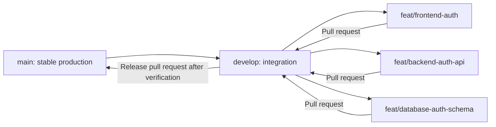
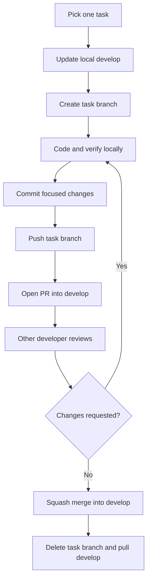
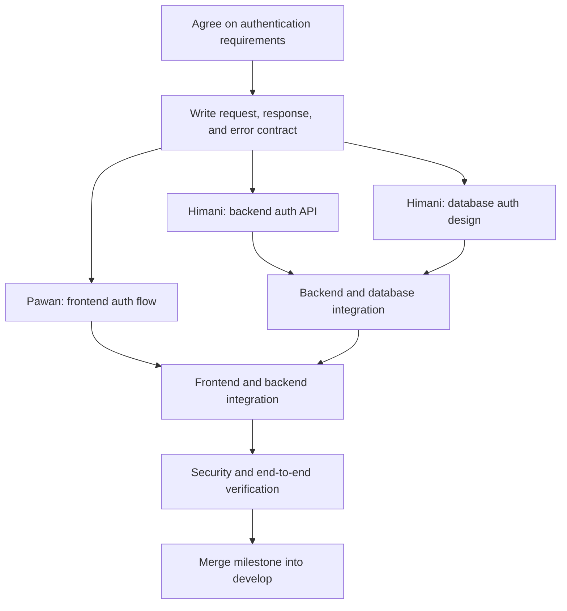
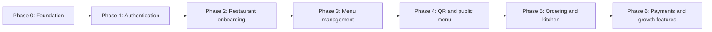

# Restaurant QR SaaS — Team Development Guide

This is the shared working agreement for the Restaurant QR SaaS project. Keep it updated whenever ownership, workflow, architecture decisions, or milestone status changes.

> Current milestone: **Phase 1 — Authentication foundation**
>
> Integration branch: **`develop`**
>
> Production branch: **`main`**

## 1. Team ownership

| Area | Primary owner | Reviewer / collaborator |
| --- | --- | --- |
| Universal frontend: web, Android, and iOS | Pawan Kshetri | Himani Singwal |
| Backend APIs and server | Himani Singwal | Pawan Kshetri |
| Database design, migrations, and data integrity | Himani Singwal | Pawan Kshetri |
| API contracts and integration decisions | Both developers | Both developers |
| Release verification and documentation | Both developers | Both developers |

Ownership means the named developer leads that area. It does not prevent the other developer from reviewing, discussing, or contributing through a pull request.

### Code ownership by path

| Path | Primary owner |
| --- | --- |
| `frontend/**` | Pawan Kshetri |
| `backend/**` | Himani Singwal |
| Future database and migration files | Himani Singwal |
| `docs/**` and root project files | Both developers |

## 2. Branch strategy

### Permanent branches

- `main`: stable production-ready code only.
- `develop`: combined and tested development work for the next release.

Never develop directly on `main` or `develop`. Every task gets a short-lived branch created from the latest `develop`.

### Task branch names

Use lowercase names with hyphens:

```text
feat/frontend-auth
feat/backend-auth-api
feat/database-auth-schema
fix/frontend-login-validation
fix/backend-auth-response
docs/team-workflow
chore/update-dependencies
```

Use one branch for one focused task. Do not mix frontend, backend, database, and unrelated fixes in a single pull request.



## 3. One-time GitHub setup

The repository owner performs these steps once from the project root:

```bash
gh auth login
gh repo create restaurant-qr-saas --source=. --remote=origin
git push -u origin main
git push -u origin develop
```

During repository creation, choose public or private as agreed by the team. Then:

1. Add the second developer as a GitHub collaborator.
2. Protect both `main` and `develop` in GitHub repository settings.
3. Require pull requests before merging.
4. Require at least one approval.
5. Disable force pushes and branch deletion for permanent branches.
6. Add required automated checks when CI is introduced.

The second developer clones the repository and switches to `develop`:

```bash
git clone <repository-url>
cd restaurant-qr-saas
git switch develop
git pull --ff-only origin develop
```

## 4. Daily development workflow

### A. Start a new task

Always begin from an updated `develop`:

```bash
git switch develop
git pull --ff-only origin develop
git switch -c feat/frontend-auth
```

Himani uses the relevant backend or database branch name instead:

```bash
git switch develop
git pull --ff-only origin develop
git switch -c feat/backend-auth-api
```

### B. Work and commit

Before committing, inspect exactly what will be included:

```bash
git status
git diff
git add <specific-files>
git diff --staged
git commit -m "feat(frontend): add authentication screen"
```

Recommended commit formats:

```text
feat(frontend): add login screen
feat(backend): add authentication endpoint
feat(database): add authentication schema
fix(frontend): show login validation error
fix(backend): reject invalid credentials
docs: update authentication contract
chore: update development dependency
```

Create small commits that describe one logical change. Never commit `.env` files, passwords, tokens, private keys, database credentials, or generated dependency folders.

### C. Push the task branch

The first push sets the upstream branch:

```bash
git push -u origin feat/frontend-auth
```

Later pushes only need:

```bash
git push
```

### D. Open a pull request

Every feature branch targets `develop`, never `main`:

```bash
gh pr create --base develop --head feat/frontend-auth
```

The pull request must explain:

- What changed.
- Why it changed.
- How it was verified.
- Any API or database impact.
- Screenshots for visible frontend changes.
- Follow-up work that is intentionally not included.

### E. Review and merge

1. The other developer reviews the pull request.
2. The author resolves requested changes on the same feature branch.
3. Automated checks and manual verification must pass.
4. Use **Squash and merge** into `develop`.
5. Delete the merged feature branch from GitHub.
6. Both developers update their local `develop`.

```bash
git switch develop
git pull --ff-only origin develop
```



## 5. Keeping a feature branch updated

If `develop` changes while a feature is in progress, bring those changes into the feature branch before final review:

```bash
git status
git fetch origin
git merge origin/develop
```

If conflicts occur:

1. Read each conflicted file carefully.
2. Discuss shared API or contract conflicts together.
3. Remove conflict markers after choosing the correct combined code.
4. Verify the project again.
5. Commit and push the resolution.

```bash
git add <resolved-files>
git commit -m "chore: resolve develop merge conflicts"
git push
```

Do not force-push shared branches. Do not use destructive Git commands to hide or discard a conflict.

## 6. Authentication milestone workflow

Frontend and backend authentication work can happen in parallel only after both developers agree on the contract.



### Contract agreement before coding

Record and agree on each item before implementation begins:

- Authentication method and session strategy.
- Required user fields and validation rules.
- User roles and permissions required for the first milestone.
- Endpoint method and path.
- Request body shape.
- Success response shape.
- Error status codes and response shape.
- Frontend session persistence behavior for web, Android, and iOS.
- Logout and expired-session behavior.
- Security requirements and secrets that must stay server-side.

Do not allow the frontend and backend to invent different request or response formats independently.

### Phase 1 task checklist

#### Shared decisions

- [ ] Agree on the exact authentication scope for version one.
- [ ] Agree on the API request, success response, and error response formats.
- [ ] Decide the database and migration approach together.
- [ ] Decide how sessions are created, stored, refreshed, expired, and revoked.
- [ ] Record decisions in the decision log below.

#### Pawan Kshetri — frontend

- [ ] Create the authentication branch from updated `develop`.
- [ ] Build shared login UI for web, Android, and iOS.
- [ ] Add frontend validation based on the agreed contract.
- [ ] Add loading, success, and error states.
- [ ] Integrate only with the agreed backend contract.
- [ ] Verify behavior on the supported frontend targets.
- [ ] Open a focused pull request into `develop`.

#### Himani Singwal — backend and database

- [ ] Create separate focused backend/database branches from updated `develop`.
- [ ] Design the minimum authentication data model.
- [ ] Add database changes through reviewed migrations when the database stack is chosen.
- [ ] Implement validation and authentication endpoints based on the agreed contract.
- [ ] Keep secrets and credential handling on the backend.
- [ ] Add backend tests for success and failure cases when the test setup is introduced.
- [ ] Open focused pull requests into `develop`.

#### Joint integration

- [ ] Merge reviewed backend/database work into `develop`.
- [ ] Update the frontend branch with the latest `develop`.
- [ ] Verify real frontend-to-backend authentication behavior.
- [ ] Verify unauthorized, invalid, expired, and logout flows.
- [ ] Update documentation before closing the milestone.

## 7. Incremental product roadmap

Build one verified milestone at a time. Do not start later SaaS features while the current milestone is unstable.

| Phase | Goal | Frontend lead | Backend/database lead | Exit condition |
| --- | --- | --- | --- | --- |
| 0 | Basic universal frontend and Express backend | Pawan | Himani | Projects run and repository workflow is ready |
| 1 | Authentication foundation | Pawan | Himani | Agreed auth flows work end to end |
| 2 | Restaurant onboarding and team access | Pawan | Himani | Restaurant and initial roles can be managed safely |
| 3 | Menu management | Pawan | Himani | Menu data can be created, edited, and displayed |
| 4 | QR and public menu experience | Pawan | Himani | A QR link opens the correct public restaurant menu |
| 5 | Ordering and kitchen workflow | Pawan | Himani | An order moves through the agreed lifecycle |
| 6 | Payments, analytics, CRM, and subscriptions | Pawan | Himani | Each capability is delivered as its own reviewed milestone |



## 8. Pull request checklist

Copy this checklist into each pull request:

```text
## Summary
- What changed:
- Why:

## Ownership
- Area: frontend / backend / database / documentation
- Primary developer:
- Reviewer:

## Verification
- [ ] Changes are limited to one task
- [ ] TypeScript/build checks pass
- [ ] Relevant manual behavior was verified
- [ ] API/database impact is documented
- [ ] No secrets or generated dependency folders are committed
- [ ] Branch is updated with develop

## Evidence
- Commands run:
- Screenshots or response examples:

## Follow-up
- Intentionally excluded work:
```

## 9. Definition of done

A task is done only when:

- The agreed acceptance criteria are met.
- The change is focused and understandable.
- Relevant type checks, builds, and tests pass.
- No credentials or private data are committed.
- API or database behavior is documented when changed.
- The other developer has reviewed and approved it.
- The pull request is merged into `develop`.
- The task branch is deleted and local `develop` is updated.

## 10. Release flow

When the selected milestone is stable on `develop`:

1. Stop adding unrelated features to that release.
2. Run frontend, backend, integration, and migration verification.
3. Open a pull request from `develop` into `main`.
4. Both developers review the release summary.
5. Merge only when the release is production-ready.
6. Tag the release when versioning begins.
7. Continue new work from the updated `develop` branch.

Emergency production fixes use a branch created from `main`, such as `hotfix/auth-session-expiry`. After merging the fix into `main`, merge the same fix back into `develop`.

## 11. Shared progress board

Keep only one main task in progress per developer to reduce unfinished work.

| Task | Owner | Branch | Status | PR |
| --- | --- | --- | --- | --- |
| Agree on authentication contract | Both | `docs/auth-contract` | Planned | — |
| Frontend authentication foundation | Pawan | `feat/frontend-auth` | Planned | — |
| Backend authentication API | Himani | `feat/backend-auth-api` | Planned | — |
| Authentication database design | Himani | `feat/database-auth-schema` | Planned | — |
| Authentication integration | Both | Created when ready | Blocked by contract | — |

Allowed statuses: `Planned`, `Ready`, `In progress`, `In review`, `Blocked`, and `Done`.

## 12. Decision log

Record decisions that affect both frontend and backend. Do not rely only on chat messages.

| Date | Decision | Reason | Owners |
| --- | --- | --- | --- |
| 2026-08-25 | Use Expo, React Native, and TypeScript for one universal frontend codebase | Share frontend code across web, Android, and iOS | Pawan and Himani |
| 2026-08-25 | Use `develop` for integration and `main` for stable production code | Keep unfinished work away from production | Pawan and Himani |
| TBD | Authentication and session strategy | Must be agreed before auth implementation | Pawan and Himani |
| TBD | Database and migration stack | Must be agreed before database implementation | Pawan and Himani |

## 13. Communication rules

- Discuss shared contracts before coding dependent work.
- Put final decisions in this guide or a linked project document.
- Mention the exact branch and pull request when asking for review.
- Raise blockers early; do not silently change an agreed API contract.
- Keep pull requests small enough for the other developer to review carefully.
- Review the progress board together at the start or end of each working session.
